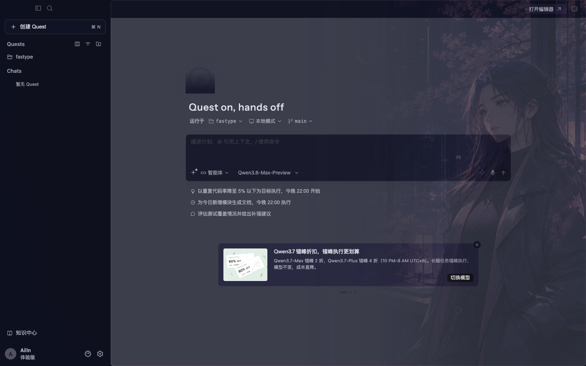

# qoder-skin-skill

[](https://github.com/Ailln/qoder-skin-skill/actions/workflows/validate.yml)
[](LICENSE)

给 [Qoder](https://qoder.com) 编辑器换肤的 Claude Code Skill。装上之后，对 Claude Code 说一句「给 Qoder 做一套赛博朋克风格的皮肤」，它会帮你把配色、背景图、毛玻璃材质一整套做好并装上。

不修改应用安装包、不动 `app.asar`、不重新签名，随时可以完整恢复。



## 换肤分两层

| 层 | 负责什么 | 怎么生效 |
|---|---|---|
| **颜色主题** | 编辑器、语法高亮、侧栏、终端、Diff，以及 Qoder 私有的 `aicoding.*` 颜色槽位 | 装成标准 VSIX 扩展，从 Dock 正常启动也生效 |
| **运行时注入** | 全窗口背景图、半透明、毛玻璃、Quest 页面背景 | 启动时开 `127.0.0.1` 本地调试端口注入 CSS，只在用本项目脚本启动时生效 |

VS Code 的主题机制不能设置窗口背景图，Quest 又是 Qoder 自己的独立渲染页面，所以背景图必须走第二层。

**从 Dock 点开 Qoder 时只有配色、没有背景图，是预期行为，不是装失败。**

## 前置条件

- macOS + 已安装 Qoder（中文版 `Qoder CN.app` 或英文版 `Qoder.app`）
- [Claude Code](https://claude.com/claude-code)
- `jq`、`node`、`zip`（`brew install jq node`，zip 和 sips 系统自带）
- 可选：`cwebp` 压缩背景图（`brew install webp`），没有会自动退回 PNG
- **一张你喜欢的背景图**——本地任意图片都行，png / jpg / heic 都能处理

## 关于背景图

背景图**需要你自己准备**。用 Claude Code 这类能生图的智能体时可以让它帮你画一张，但换个智能体（比如 Qoder 自带的）就没这个能力了，所以默认按"你提供图片"来走。

挑图有三条标准：**主体在画面右侧**（左侧要留给文件树和代码）、**整体偏暗**、**细节别太密**。主体在左侧的图可以用 `--flip` 镜像翻过去；在正中间的建议换一张。

图会自动缩放、压成 WebP，并**丢掉 EXIF 元数据**（手机照片里的 GPS 坐标不会被带进主题包）。

实在没有合适的图，也可以只装第一层颜色主题——照样是一套完整可用的配色，只是没有背景图和毛玻璃。

## 安装

```bash
git clone git@github.com:Ailln/qoder-skin-skill.git ~/.claude/skills/qoder-skin
```

装完在 Claude Code 里直接说：

> 给 Qoder 做一套深海风格的皮肤，背景图用 ~/Pictures/ocean.jpg

Claude 会先和你确认主题名、配色和背景图构图，确认后再生成文件、处理背景图、打包安装、带调试端口启动 Qoder，最后逐项验证可读性。

## 不用 Claude Code 也行

```bash
cd ~/.claude/skills/qoder-skin

# 1. 从内置的月夜樱基线脚手架出一套新皮肤
./scripts/new-skin.sh qoder-deep-ocean "Qoder 深海" --desc "冷色调深海主题"

# 2. 处理背景图（--flip 用于主体在左侧的图）
./scripts/prepare-background.sh qoder-deep-ocean ~/Pictures/ocean.jpg

# 3. 改 skins/qoder-deep-ocean/ 里的主题 JSON 和 skin.css
#    配色怎么改见 references/color-system.md

# 4. 静态自检
./scripts/validate.sh qoder-deep-ocean

# 5. 打包并安装颜色主题，装完在 Qoder 里选：
#    文件 → 首选项 → 主题 → 颜色主题 → Qoder 深海
./scripts/install-theme.sh qoder-deep-ocean

# 6. 先用 ⌘Q 完全退出 Qoder（含 Quest 窗口），再启动完整皮肤
./scripts/launch-themed-qoder.sh qoder-deep-ocean

# 7. 实机验证对比度，不达标会列出具体是哪几处文字
./scripts/check-contrast.sh qoder-deep-ocean
```

英文版 Qoder 或非默认安装路径，用环境变量指定：

```bash
export QODER_APP_PATH='/Applications/Qoder.app'
export QODER_CLI='/Applications/Qoder.app/Contents/Resources/app/bin/code'
```

## 恢复

```bash
./scripts/restore.sh                    # 移除背景图和毛玻璃，停掉注入器
```

配色需要在 Qoder 里手动切回内置主题（如 Qoder Dark）。彻底卸载颜色主题：

```bash
'/Applications/Qoder CN.app/Contents/Resources/app/bin/code' \
  --uninstall-extension <publisher>.<slug>
```

## 目录结构

```
SKILL.md          Skill 主文件：换肤流程与安全边界
references/       配色系统、运行时注入原理、背景图要求、故障排查
runtime/          皮肤无关的共享注入运行时
scripts/          脚手架、校验、对比度门禁、打包、安装、启动、恢复
templates/        新皮肤模板
skins/            各套皮肤，内置示例 qoder-moonlit-sakura
```

## 安全边界

这套方案坚持以下约束，改动都可逆：

- 不修改 Qoder 安装目录内任何文件，不改 `app.asar`，不重新签名。
- 调试端口仅绑定 `127.0.0.1`，退出 Qoder 后随应用关闭。
- 注入器只连接 URL 含 `vscode-app` / `vscode-file` 的 Qoder 渲染页面，不对任意网页注入。
- 图片和 CSS 只从皮肤目录读取。
- 恢复时只移除自己创建的 `qoder-skin-*-style` 样式节点和注入器进程，不碰用户配置、扩展和工作区文件。

## 兼容性

已在 **Qoder CN 1.8.1（VS Code 1.103 基础）/ macOS** 上实机验证。

Qoder 升级后 DOM 结构和 `aicoding.*` 颜色键可能变化，升级后建议重跑一遍 `references/troubleshooting.md` 里的验证清单。目前只支持 macOS——Windows / Linux 的应用路径和启动方式不同，脚本需要改。

## 内置示例：月夜樱

`skins/qoder-moonlit-sakura/` 是一套完整可用的皮肤，同时也是新皮肤的配色基线（203 个颜色键，含 34 个已验证的 `aicoding.*` 键）。

主视觉由 AI 生成，原创角色与场景，无现成动漫 IP、无品牌元素。

## 许可

代码、脚本和文档以 [MIT](LICENSE) 发布。

`skins/qoder-moonlit-sakura/assets/` 下的插画为 AI 生成的原创素材，同样按 MIT 提供，但请注意 AI 生成内容的版权在不同司法辖区仍存在争议，商业使用前请自行评估。

本项目与 Qoder 官方无关。换肤依赖 Qoder 的内部页面结构和颜色键，升级后可能失效，请自担风险。
